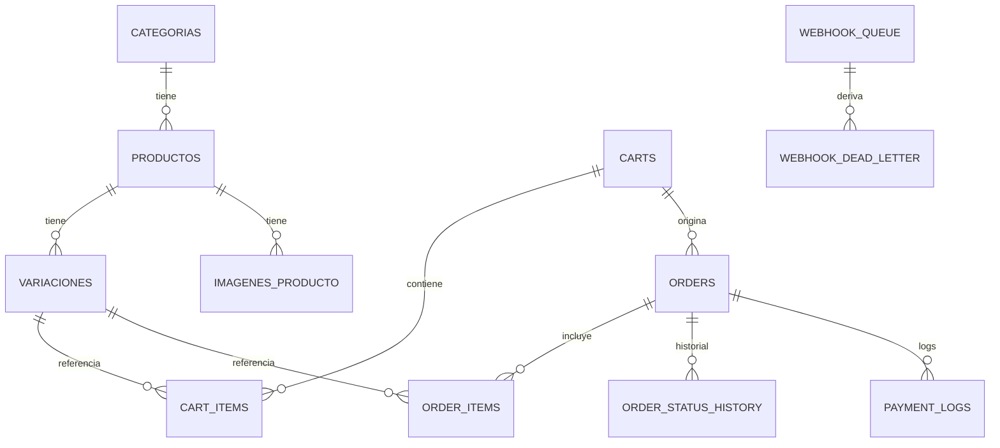
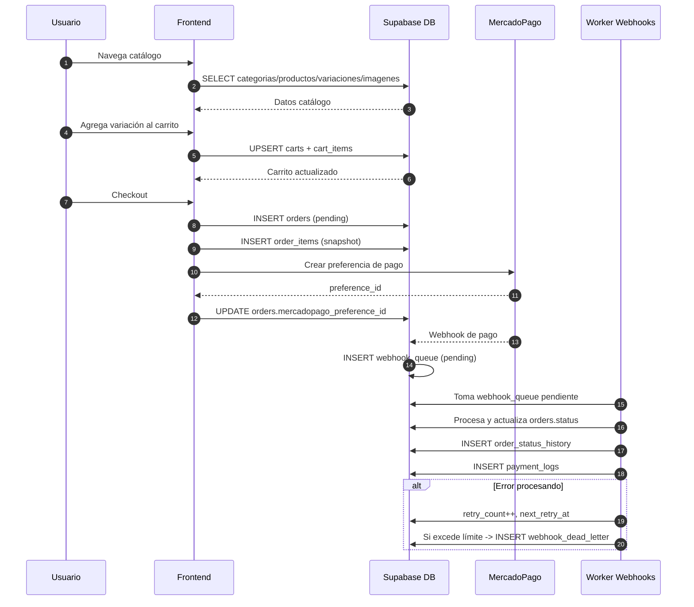

# SQL Code — Reference

Este directorio contiene scripts SQL operativos y un snapshot de esquema para contexto.

## Archivos

- `run-all-security-fixes.sql`: script único para aplicar los fixes de seguridad/linter en Supabase.
- `rollback-security-fixes-dev.sql`: rollback solo para desarrollo/local.
- `supabase.sql`: snapshot del esquema actual (referencia, no ejecutar como migración).

## Cuál usar y cómo

### 1) Aplicar hardening (staging/producción)

Usar `run-all-security-fixes.sql`.

- Supabase Dashboard: SQL Editor → pegar/abrir script → Run.
- Terminal:

```bash
psql "$SUPABASE_DB_URL" -f scripts/sql-code/run-all-security-fixes.sql
```

### 2) Revertir en desarrollo (solo dev)

Usar `rollback-security-fixes-dev.sql`.

```bash
psql "$SUPABASE_DB_URL" -f scripts/sql-code/rollback-security-fixes-dev.sql
```

## Seguridad implementada (hardening)

El script `run-all-security-fixes.sql` aplica estas medidas:

1. **RLS habilitado en tablas internas de `public`**
   - `order_status_history`
   - `webhook_queue`
   - `webhook_dead_letter`
   - `webhook_reconciliation_logs`

2. **Bloqueo de acceso directo desde cliente**
   - Policy `Deny direct access` para roles `anon` y `authenticated` en las tablas internas.
   - Resultado: el frontend no puede leer/escribir directamente esas tablas; se operan desde backend controlado.

3. **Policy de `consultas` sin condición always-true literal**
   - Reemplaza `WITH CHECK (true)` por una condición explícita basada en rol.
   - Mantiene el flujo público de contacto y elimina el warning del linter.

4. **`search_path` fijo en funciones sensibles**
   - `update_timestamp`
   - `log_order_status_change`
   - `cleanup_expired_carts`
   - `update_webhook_queue_timestamp`
   - `update_webhook_dead_letter_timestamp`
   - Resultado: evita `function_search_path_mutable` y reduce riesgo por resolución de objetos inesperados.

## Checklist post-deploy (Supabase)

Usar esta checklist después de correr `run-all-security-fixes.sql` en staging/producción:

- [ ] 1) Script ejecutado sin errores en SQL Editor.
- [ ] 2) Re-ejecutar **Database Linter** y confirmar que no aparecen:
  - [ ] `rls_disabled_in_public` para las 4 tablas internas.
  - [ ] `function_search_path_mutable` para las 5 funciones.
  - [ ] `rls_policy_always_true` en `consultas`.
- [ ] 3) Verificar estado de RLS:

```sql
SELECT schemaname, tablename, rowsecurity
FROM pg_tables
WHERE schemaname = 'public'
  AND tablename IN (
    'order_status_history',
    'webhook_queue',
    'webhook_dead_letter',
    'webhook_reconciliation_logs',
    'consultas'
  )
ORDER BY tablename;
```

- [ ] 4) Verificar policies de tablas afectadas:

```sql
SELECT schemaname, tablename, policyname, roles, cmd, qual, with_check
FROM pg_policies
WHERE schemaname = 'public'
  AND tablename IN (
    'order_status_history',
    'webhook_queue',
    'webhook_dead_letter',
    'webhook_reconciliation_logs',
    'consultas'
  )
ORDER BY tablename, policyname;
```

- [ ] 5) Verificar `search_path` de funciones:

```sql
SELECT
  n.nspname AS schema,
  p.proname AS function,
  pg_get_function_identity_arguments(p.oid) AS args,
  array_to_string(p.proconfig, ', ') AS function_config
FROM pg_proc p
JOIN pg_namespace n ON n.oid = p.pronamespace
WHERE n.nspname = 'public'
  AND p.proname IN (
    'update_timestamp',
    'log_order_status_change',
    'cleanup_expired_carts',
    'update_webhook_queue_timestamp',
    'update_webhook_dead_letter_timestamp'
  )
ORDER BY function;
```

- [ ] 6) Smoke test funcional:
  - [ ] crear consulta desde frontend (`consultas` INSERT)
  - [ ] ejecutar flujo de checkout básico
  - [ ] validar que webhook queue procese eventos como esperado

- [ ] 7) Confirmar que **NO** se ejecutó rollback en staging/prod.

---

## Modelo de datos (ER simplificado)



## Flujo de pedido completo (secuencia)



## Notas importantes

- `supabase.sql` es de contexto y puede no tener orden ejecutable de constraints.
- Para linter/security, la fuente operativa son los scripts de hardening y rollback.
- Evitar correr scripts de desactivación de RLS en entornos productivos.
